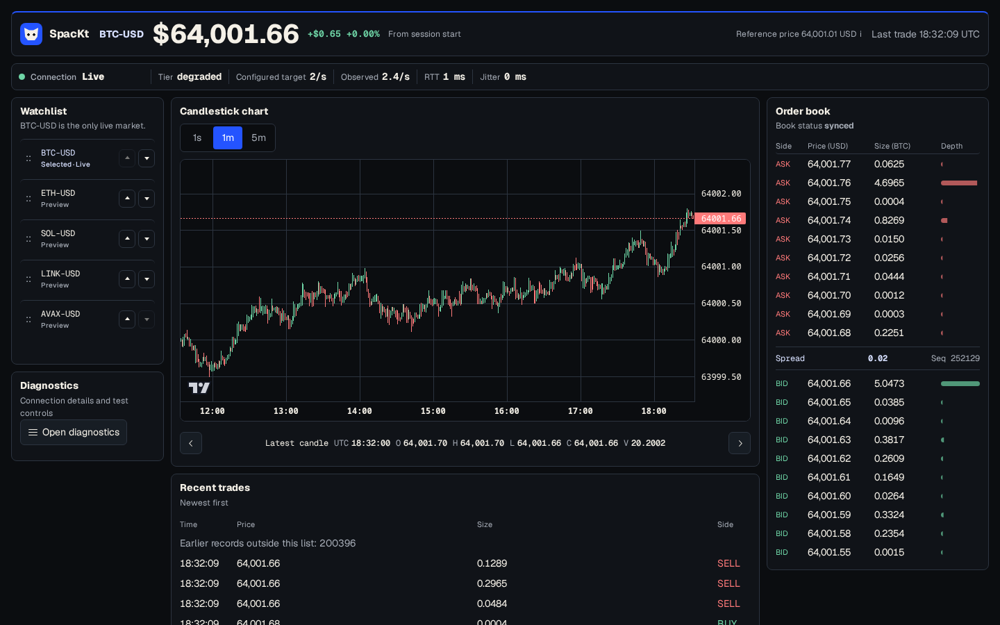

# SpacKt

SpacKt, pronounced **Space Cat**, is a real-time BTC-USD market console.
It runs one simulated market and adapts live delivery for each browser.

The backend owns the complete market stream.
The frontend renders the chart, order book, trades, connection state, and debug controls.
No exchange account, database, or external market feed is required.



## Architecture

SpacKt uses a Go backend and a static Next.js frontend.
The frontend uses the App Router and exports static files.
The backend uses `net/http` and `github.com/coder/websocket`.

The App Router keeps layout, fonts, and metadata separate from the client runtime.
Static export means production serves files, not a Node.js server.

One backend goroutine owns the market book, trades, candles, and history.
Each WebSocket connection owns its delivery state separately.
This stops slow browsers from changing market generation.
The frontend keeps UI, network, state, engines, and chart rendering separate.
The chart library renders local data only.
Read [docs/architecture.md](docs/architecture.md) for design details.

State management uses one immutable market snapshot for React.
Pure TypeScript engines process protocol events before React renders them.
Zustand vanilla subscriptions publish the current snapshot.
`requestAnimationFrame` batches bursty updates into frame-sized UI changes.

## Market Data And Protocol

The backend simulates one `BTC-USD` market.
Prices use integer cents.
Quantities use integer `0.0001 BTC` lots.
Wire messages send decimal strings.
The default seed is `7`.

REST provides bootstrap data.
WebSocket provides ordered live updates and control messages.
All market responses include the backend session.
The REST endpoints are `/api/meta`, `/api/book`, `/api/candles`, and `/api/trades`.
Health endpoints are `/healthz` and `/readyz`; the WebSocket endpoint is `/ws`.
The server sends `hello` before the browser subscribes to one candle interval.

Read [docs/protocol.md](docs/protocol.md) and [docs/schemas.md](docs/schemas.md) for exact fields.

## Synchronization

The browser merges history and live candles by revision.
Each candle key uses session, symbol, interval, and open time.
The browser accepts the higher candle revision for the same key.
A late interval response cannot replace the current view.

The order book starts from a REST snapshot.
The browser buffers WebSocket ranges while the snapshot is in flight.
It replays ranges in order after the snapshot arrives.
It requests a fresh snapshot when a range is missing or out of order.

## Latency, Jitter, And Tiers

The browser sends an application ping every second while visible.
The server echoes a pong with the same ID.
Latency is the median of recent round-trip times.
Jitter is the mean absolute difference between adjacent successful RTT samples.
Jitter uses successful samples in ping send order.
The browser allows four pending pings.
It times out a ping after 3 seconds.
It keeps 10 successful samples sent within 10 seconds.
It reports every 2 seconds after at least two fresh samples.

The backend owns tier decisions per WebSocket connection.
The server processes every generated trade at every tier.
Final candle values stay complete at every tier.
The displayed trade list is bounded and can report omitted trades.
Tiers change delivery frequency, not market generation.

| Tier | Target chart cadence |
| --- | ---: |
| `full` | 10 updates per second |
| `degraded` | 2 updates per second |
| `minimal` | 0.5 updates per second |

| Transition | Rule |
| --- | --- |
| `full` to `degraded` | Latency `>400ms` or jitter `>60ms` for 3 seconds. |
| any tier to `minimal` | Latency `>900ms` or jitter `>150ms` for 3 seconds. |
| `degraded` to `full` | Latency `<300ms` and jitter `<40ms` for 10 seconds. |
| `minimal` to `degraded` | Latency `<700ms` and jitter `<100ms` for 10 seconds. |

Missing reports downgrade one tier after 5 seconds.
Missing reports set `minimal` after 12 seconds.
A hidden tab uses `minimal` delivery and pauses report penalties.

These values are demonstration choices.
They are not universal network standards.
The separate down and up thresholds reduce repeated tier switching.
The 3 second down dwell reacts faster than the 10 second up dwell.

## Reconnect, Lifecycle, And Debug

The browser shows cached values as stale after a disconnect.
It reconnects with full jitter and a maximum 10 second delay.
It resets the retry counter after 30 seconds of healthy synchronized operation.

Close code `4002` shows reload.
Close code `4008` waits 10 to 30 seconds before retry.
Close code `4009` permits one automatic fresh reload.
A second `4009` before healthy recovery requires manual retry.

Hidden tabs stop application probes.
The server can close a hidden socket after 180 seconds.
The browser waits until the tab is visible before it opens a new socket.

The diagnostics drawer can force tiers, delay pongs, drop one book delta, and disconnect this session.
Each debug command affects only the current browser connection.
Watchlist rows move with the up and down buttons.
Pointer users can drag a row by its handle.

## Packages Used

Runtime packages are Go `1.27.1` and `github.com/coder/websocket` `1.8.15`.
Frontend packages are Next.js `16.3.5`, React `19.3.0`, and TypeScript `6.0.3`.
State and validation packages are Zustand `5.0.15` and Zod `4.6.5`.
UI packages are Lightweight Charts `5.2.1`, Tailwind CSS `4.3.3`, and Radix UI.
Test packages are Vitest `5.0.1` and Playwright `1.63.0`.

Reasons are in [docs/architecture.md](docs/architecture.md); notices are in [NOTICE](NOTICE).
The chart retains the TradingView attribution link.

## Local Development

Use Go `1.27.1`, Node.js `22.23.2`, and npm `12.0.2`.

Terminal 1:

```sh
go -C backend run ./cmd/server
```

Terminal 2:

```sh
npm --prefix web ci
npm --prefix web run dev
```

The backend listens on `http://localhost:8080`.
The frontend runs at `http://localhost:3000`.
The local WebSocket endpoint is `ws://localhost:8080/ws`.

Run both services in containers:

```sh
docker compose up --build --wait
```

## Verification

Run these checks from the repository root:

```sh
go -C backend test -race -timeout 300s ./...
go -C backend vet ./...
go -C backend run ./cmd/checkrepo -root .. -mode local
npm --prefix web run typecheck
npm --prefix web run lint
npm --prefix web run test:coverage
npm --prefix web run test:security
npm --prefix web run build
npm --prefix web run test:e2e
docker compose config --quiet
docker compose up --build --wait
```

CI runs repository policy, backend tests, frontend tests, static build, and container browser tests.

## Deployment And Configuration

SpacKt deploys as two Render services:
a backend Docker web service and a frontend static site.
`render.yaml` defines both services.

Set backend `SPACKT_ALLOWED_ORIGINS` to the exact frontend origin.
Set frontend `NEXT_PUBLIC_API_URL` to the exact backend origin.
Then rebuild the frontend.
Static builds freeze `NEXT_PUBLIC_API_URL` into generated files.

Backend variables live in [backend/.env.example](backend/.env.example).
Frontend variables live in [web/.env.example](web/.env.example).
See [docs/deployment.md](docs/deployment.md) for full deployment steps.

## Known Limitations

SpacKt runs one in-memory market instance.
A restart creates a new backend session.
It does not place real orders, connect to a real exchange, or persist server market data.
The watchlist contains preview rows, but only `BTC-USD` is live.
The static frontend must be rebuilt when the backend origin changes.
